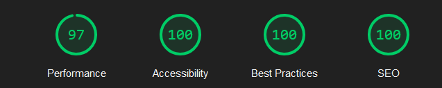

# Svelte-Weather-App

## 🌟 Features

### 📊 気象データ表示
- 気象庁アメダスデータから最低気温ランキングを生成・表示
- リアルタイムでのデータ更新（取得先準拠）

### 🗺️ インタラクティブ地図
- Google Maps APIを使用した地域の地図表示
- 選択した地点の詳細位置情報

### 🤖 AI機能
- Google Gemini APIを使用した解説生成
- データキャッシュによるAPI呼び出し削減

### 🎨 モダンUI/UX
- モバイルファーストデザイン
- ダークモード対応
- Material Symbolsアイコン使用

### ⚡ パフォーマンス
- Lighthouse Performance 97点 
- 外部フォントの部分読み込みとレイアウトシフト防止
- 外部サービスの事前DNS解決によるレスポンス向上(DNS Prefetch)
- コンポーネントレベルでの遅延読み込み
- rollup-plugin-visualizerによるバンドルサイズ解析・最適化

### 🔐 セキュリティ
- サーバーサイドでのAPI呼び出し
- SvelteKitデフォルトのCSRF保護


## 🛠️ Tech Stack

### Frontend
- SvelteKit
- TypeScript
- Tailwind CSS
- Vite

### Backend
- Google Maps API
- Google Gemini API
- 気象庁アメダスデータ(JSON format)

本アプリは気象庁が公開するアメダスデータを利用していますが、気象庁とは一切関係ありません。

### Infrastructure
- Vercel
- Vercel Blob

## 🚀 Setup

### Prerequisites
- Node.js v18 or higher
- npm

### 環境変数設定
`.env`ファイルを作成し、以下のAPIキーを設定してください。

```env
VITE_GOOGLE_MAPS_API_KEY=your_google_maps_api_key
VITE_GOOGLE_AI_API_KEY=your_google_ai_api_key
```

### install & run
```bash
# 依存関係をインストール
npm install
# 開発サーバー起動
npm run dev
# ビルド
npm run build
```
Vercelでデプロイする場合はVercel Blobを有効にしてください。
